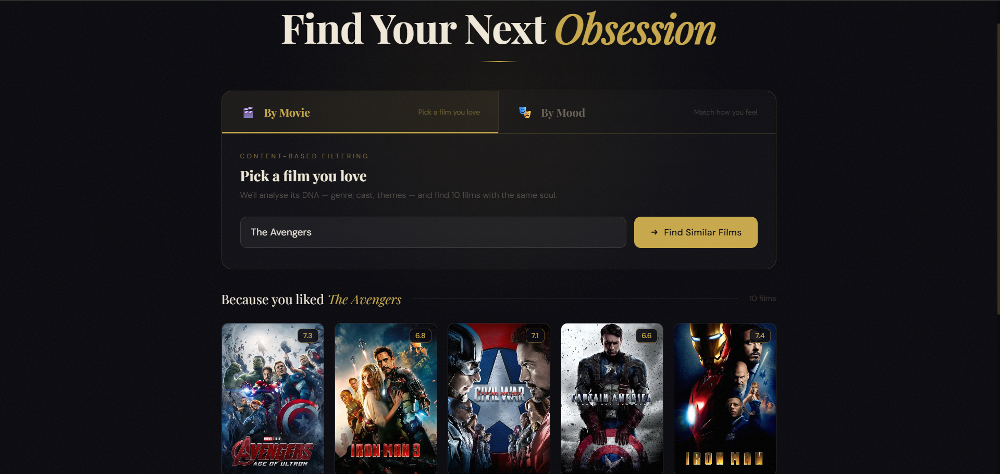
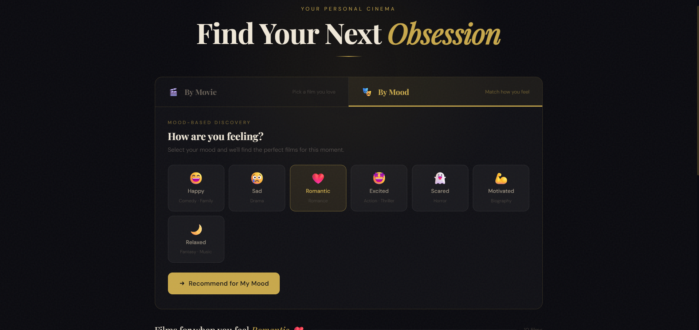
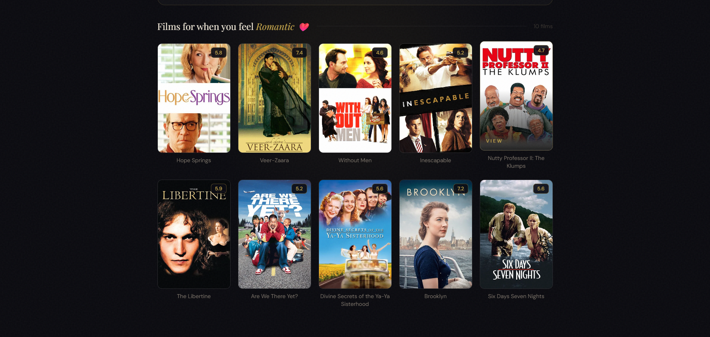
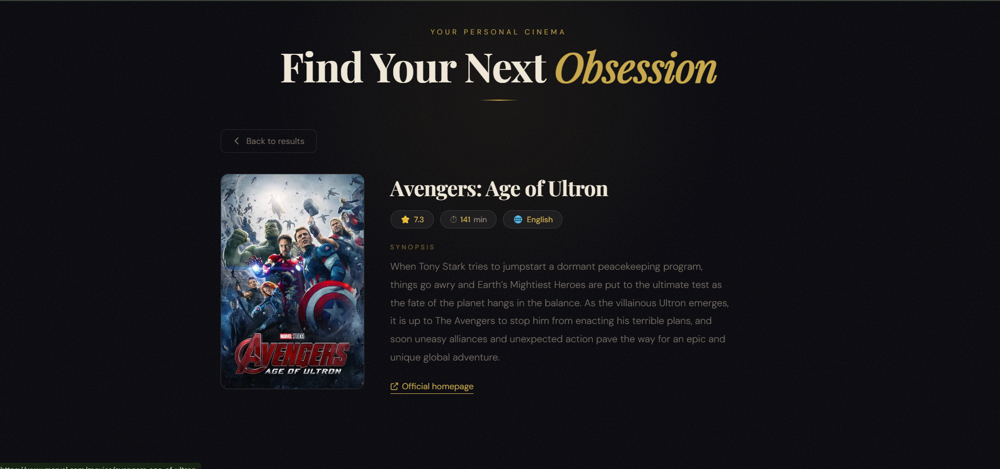

# 🎬 Movie Recommendation System

A web application that recommends movies based on similarity and mood using a fast precomputed model.

---

## Features

* Content-based movie recommendations
* Mood-based movie suggestions
* Movie posters using TMDB API
* Fast results using precomputed similarity (Joblib)
* Clean and simple UI

---

## UI Preview






---

## Model Files

Large files are not included due to GitHub size limits.

👉 Download required files:
**[https://drive.google.com/drive/folders/1jKQaX-mcdFNNIV71obQgBHe7xq7yxzuf?usp=sharing]**

Required:

* movie_data.joblib
* similarity.joblib

---

## Tech Stack

* Python
* Flask
* Pandas
* Joblib
* HTML, CSS, JavaScript
* TMDB API

---

## How to Run

pip install -r requirements.txt
python app.py

Then open the application in your browser.

---

## 📂 Project Structure

```
project/
│── app.py
│── index.html
│── requirements.txt
│── README.md
│── .gitignore
│
├── assets/
│   ├── Content-based filtering.png
│   ├── Mood-based discovery.png
│   ├── Movie details.png
│   └── Results.png
```

---

## 💡 Future Improvements

* Improve UI (Netflix-style)
* Add user authentication
* Add more filters
* Deploy online

---

## 👨‍💻 Author

Akash Kumar Bag
